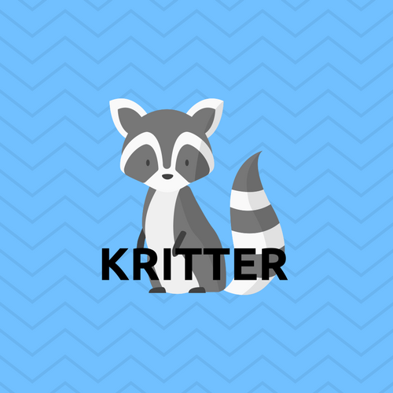

# Kritter~ Finally, there is a Social Media for your animals!
Visit us at http://www.kritter.club/.

 

## Table of Contents
1. [About The Application](https://github.com/arn1313/kritter-frontend/blob/master/README.md#about-the-application)
2. [How To Use](https://github.com/arn1313/kritter-frontend/blob/master/README.md#how-to-use)
3. [User Sign Up](https://github.com/arn1313/kritter-frontend/blob/master/README.md#user-sign-up)
4. [User Sign In](https://github.com/arn1313/kritter-frontend/blob/master/README.md#user-sign-in)
5. [Kritter Dependencies](https://github.com/arn1313/kritter-frontend/blob/master/README.md#kritter-dependencies)
6. [How To Report Bugs or Issues](https://github.com/arn1313/kritter-frontend/blob/master/README.md#how-to-report-bugs-or-issues)
7. [Credits And Thanks](https://github.com/arn1313/kritter-frontend/blob/master/README.md#credits-and-thanks)
8. [Upcoming Features](https://github.com/arn1313/kritter-frontend/blob/master/README.md#upcoming-features)
9. [FAQs](https://github.com/arn1313/kritter-frontend/blob/master/README.md#faqs)

### About the Application
 We built Kritter as a Social Media platform for your pets. Finally the unrepresented members of your family have their own platform to express themselves to the world with a little bit of help from you and your thumbs.

### How to Use
To use the app just navigate to our website located at http://www.kritter.club/ and create an account. After you become a member you will have full access to all the features of Kritter.

### User Sign Up
Once you have arrived to the website, you will be prompted to create an account. This will require you to input a valid email address and create a password. On your first sign in you will also be asked to upload a picture of your pet and fill out a short bio.

### User Sign In
Once you have set up your account, the next time you visit the site you will be prompted to enter your email and password and you will be ready to start connecting and sharing with all animal friends.

### Kritter Dependencies

#### Dev Dependencies

* **debug** : A dependency used to catch errors in the creation of the app. If a user wants to contribute to solving issues for Kritter, it's suggested you fork our repository, and use debug to help us find where the issues stem from. For more information on contributing to Kritter, see the "How To Report Bugs or Issues" section.

  * Documentation can be found at https://www.npmjs.com/package/debug.

* **eslint** : A linting tool used to evaluate our code to catch any syntax errors. I

  * Documentation can be found at https://www.npmjs.com/package/eslint.

* **faker** : A dependency used to create users with fake information, used in our testing environment.

  * Documentation can be found at https://www.npmjs.com/package/faker.

* **jest** : Our dependency for our testing environment.

  * Documentation can be found at  http://facebook.github.io/jest.

* **superagent** : An additional dependency for our test environment. It is used to fire off our servers with a test connection to see if our users can properly access their camera.

  * Documentation can be found at http://visionmedia.github.io/superagent.

#### Dependencies

* **aws-sdk** : Provides Javascript API's for AWS services.

  * Documentation can be found at https://www.npmjs.com/package/aws-sdk

* **aws-sdk-mock** : Tests AWS functions.

  * Documentation can be found at https://www.npmjs.com/package/aws-sdk-mock.

* **babel** : A transpiler for Javascript which allows the usage of ES6 syntax.

  * Documentation can be found at https://www.npmjs.com/package/babel-core

* **babel-cli** :Provides a command line for babel.

  * Documentation can be found at https://www.npmjs.com/package/babel-cli.

* **babel-core** : Babels compiler core.

  * Documentation can be found at https://www.npmjs.com/package/babel-core.

* **babel-loader** : Allows transpiling Javascript files using Babel and webpack.

  * Documentation can be found at https://www.npmjs.com/package/babel-loader.

* **babel-plugin-transform-object-rest-spread** : Allows babel to transform rest properties for object destructuring assignments and spread properties for object literals.

  * Documentation can be found at https://www.npmjs.com/package/babel-plugin-transform-object-rest-spread.

* **babel-preset-es2015** : Presets for es2015 plugins.

  * Documentation can be found at https://www.npmjs.com/package/babel-preset-es2015.

* **babel-preset-react** : Presets for React plugins.

  * Documentation can be found at https://www.npmjs.com/package/babel-preset-react.

* **babel-register** : A require hook for using babel.

  * Documentation can be found at https://babeljs.io/docs/usage/babel-register/.

* **bcrypt** : A dependency to hash our users' passwords, for their security.

  * Documentation can be found at https://www.npmjs.com/package/bcrypt.

* **body-parser** : Our middleware dependency to parse incoming request bodies (JSON).

  * Documentation can be found at https://www.npmjs.com/package/body-parser.

* **clean-webpack-plugin** :

  * Documentation can be found at https://www.npmjs.com/package/clean-webpack-plugin.

* **cookie-parser** : Parses our cookies and puts the cookie information on req object in the middleware.

  * Documentation can be found at https://www.npmjs.com/package/cookie-parser.

* **css-loader** : Interprets @import and url() like import/require() and will resolve them.

  * Documentation can be found at https://www.npmjs.com/package/css-loader.

* **cors** : CORS is a node.js package for providing a Connect/Express middleware that can be used to enable CORS with various options.

  * Documentation can be found at https://www.npmjs.com/package/cors.

* **dotenv** : Dotenv is a zero-dependency module that loads environment variables from a .env file into process.env.

  * Documentation can be found at https://www.npmjs.com/package/dotenv.

* **express** : Fast, unopinionated, minimalist web framework for node. Used to create a http server, and used for request routing.

  * Documentation can be found at http://expressjs.com.

* **extract-text-webpack-plugin** : Extracts text from a bundle, or bundles, into a separate file.

  * Documentation can be found at https://www.npmjs.com/package/extract-text-webpack-plugin.

* **file-loader** : Instructs webpack to emit the required object as a file and to return its public URL.

  * Documentation can be found at https://www.npmjs.com/package/file-loader.

* **fs-extra** : Adds file system methods that are not included in the native fs module.

  * Documentation can be found at https://www.npmjs.com/package/fs-extra.

* **http-errors** : Creates http errors for Express.

  * Documentation can be found at https://www.npmjs.com/package/http-errors.

* **html-webpack-plugin** : Simplifies the creation of HTML files to serve the webpack bundles.

  * Documentation can be found at https://www.npmjs.com/package/html-webpack-plugin.

* **json-parser** : JSON parser to parse JSON object and MAINTAIN comments.

  * Documentation can be found at https://www.npmjs.com/package/json-parser.

* **jsonwebtoken** : An implementation of JSON Web Tokens. Used for user authorization.

  * Documentation can be found at https://www.npmjs.com/package/jsonwebtoken.

* **material-ui** : Is a set of React components that implement Google's Material Design specification.

  * Documentation can be found at https://www.npmjs.com/package/material-ui.

* **material-ui-icons** : Provides the Google Material Icons as a set of React components.

  * Documentation can be found at https://www.npmjs.com/package/material-ui-icons.

* **mongoose** : Mongoose is a MongoDB object modeling tool designed to work in an asynchronous environment. This was used to create schemas for our users.

  * Documentation can be found at https://www.npmjs.com/package/mongoose.

* **multer** : Multer is a node.js middleware for handling multipart/form-data, which is primarily used for uploading files. It is written on top of busboy for maximum efficiency.

  * Documentation can be found at https://www.npmjs.com/package/multer

* **nodemon** : Watches all files in your directory and refreshes your node application as changes are made.

  * Documentation can be found at https://www.npmjs.com/package/nodemon.

* **node-sass** : Node-sass is a library that provides binding for Node.js to LibSass.

  * Documentation can be found at https://www.npmjs.com/package/node-sass.

* **ramda** : A library for Javascript that assists with functional programming.

  * Documentation can be found at https://www.npmjs.com/package/ramda.

* **react** : Allows immediate access to React without requiring a JSX transformer.

  * Documentation can be found at https://www.npmjs.com/package/react.

* **react-bootstrap** : Is a library of reusable front-end components.

  * Documentation can be found at https://www.npmjs.com/package/react-bootstrap.

* **react-dom** : Serves as an entry point of the DOM-related rendering paths.

  * Documentation can be found at https://www.npmjs.com/package/react-dom.

* **react-redux** : Is a predictable state container for Javascript apps.

  * Documentation can be found at https://www.npmjs.com/package/react-redux.

* **react-router-dom** : DOM bindings for the React Router.

  * Documentation can be found at https://www.npmjs.com/package/react-router-dom.

* **react-scroll-to-component** : Smooth scrolls to React component via reference.

  * Documentation can be found at https://www.npmjs.com/package/react-scroll-to-component.

* **react-test-renderer** : Provides an experimental React renderer that can be used to render React components to pure Javascript objects.

  * Documentation can be found at https://www.npmjs.com/package/react-test-renderer.

* **redux** : Is a predictable state container for Javascript apps.

  * Documentation can be found at https://www.npmjs.com/package/redux.

* **redux-persist** : Is a wrapper that saves a redux state to storage.

  * Documentation can be found at https://www.npmjs.com/package/redux-persist.

* **sass-loader** : Loads a SASS/SCSS file and compiles it to CSS.

  * Documentation can be found at https://www.npmjs.com/package/sass-loader.

* **uglifyjs-webpack-plugin** : Minifies Javascript.

  * Documentation can be found at https://www.npmjs.com/package/uglifyjs-webpack-plugin.

* **url-loader** : Loads files as 'base64' encoded url.

  * Documentation can be found  https://www.npmjs.com/package/url-loader.

* **webpack** : Is a module bundler thats purpose is to bundle Javascript files for usage in a browser.

  * Documentation can be found at https://www.npmjs.com/package/webpack.

* **webpack-dev-server** : Provides fast in-memory access to webpack assets.

  * Documentation can be found at https://www.npmjs.com/package/webpack-dev-server.

### How to Report Bugs or Issues
Bugs and Issues can be reported through our GitHub repository located at https://github.com/arn1313/kritter-frontend/issues. To create a new issue, simply click the green "New Issue" button, and add a description of the issue or bug, with a method for replication if possible.

### Credit and Thanks
We obviously borrowed heavily from current Social Media's like Facebook and Twitter for our styling and the thought process behind our choices of functionality.
We modeled our backend off of the sluggram-backend created by Duncan Marsh https://github.com/slugbyte and greatly appreciate all of the hard work he put into the build.

### Upcoming features
**Friends** We would love to add a friends feature in future updates. This way your pets could create circles. Also by adding this functionality, we could begin to incorporate an events calendar, so your pets can schedule play dates with their friends.

### FAQs
**Why Kritter?** People love their pets and there are plenty of animals represented on Social Media. We thought it was time pets had their own platform to shine and share their stories.

**How long did it take to build?** We built Kritter in four days with four developers.

**OurTeam**

+ **Gavin**:

 

Gavin was born and raised locally here in the Pacific Northwest. In his past career at Pierce County Sheriff's Department he learned a lot about himself. The greatest of those things are that he loves to help people. He lives for the feeling he gets after truly making someone happy. This led him to search for a new career where he could satisfy his need to help. Gavin found technology, more specifically Github, where he discovered there are thousands of people that are creating things for free, just to help others. He was hooked he knew this was where he wanted to be.

+ **Katherine**:  

 

+ **Isaiah**:  

 

Isaiah is full-stack web developer who utilizes the MERN stack. His past experience was in sales, marketing, management, and customer service where he uncovered his passion of helping others through innovative problem solving. With his skills as a developer and the creative freedom that comes with programming, Isaiah is now better suited to help others through creative problem solving and ready to make a positive impact on the world. 

+ **Aaron**:  

 

Aaron moved to Seattle from San Francisco in 1999.  He worked in retail and bank management for many years but transitioned into a role as an Office Manager and Paralegal in 2012. During that time he assisted on several high profile lawsuits including the Oso Land Slide case in Snohomish County. Earlier this year he decided that he needed a change and a career more inline with the direction Seattle has been moving. This led him to Code Fellows and a future in tech.
